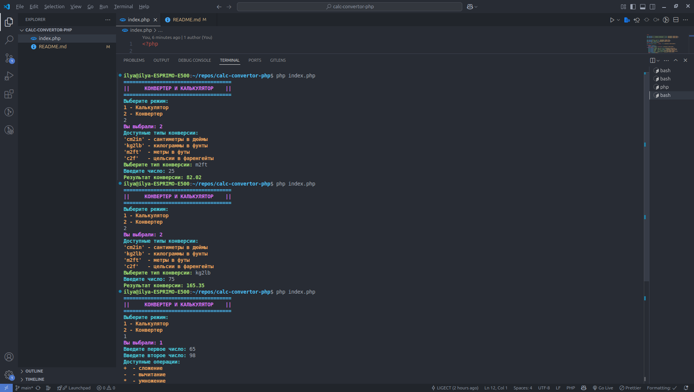

# 🧮 Консольный калькулятор и конвертер на PHP

Мой первый учебный проект на PHP с цветным интерфейсом в терминале.



## 🔥 Возможности

### 🧮 Калькулятор

- Все базовые операции: +, -, \*, /
- Возведение в степень (\*\*)
- Защита от деления на ноль

### 📏 Конвертер

- Длины: см → дюймы, метры → футы
- Веса: кг → фунты
- Температуры: °C → °F

## 🚀 Как установить и запустить

1. Скачайте файл `calculator.php`
2. Откройте терминал в папке с файлом
3. Запустите командой:
   ```bash
   php index.php
   ```
